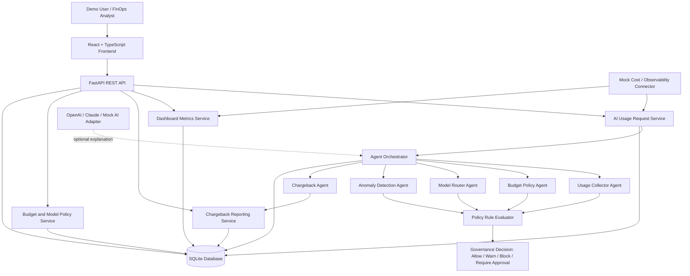

# AI-08 AI Cost & Usage Governance Architecture

## 1 High Level Architecture

This architecture defines a one-day hackathon MVP for an AI FinOps Governance platform. The platform tracks AI usage, token consumption, budgets, quotas, model selection, cost anomalies, and chargeback reporting.

The solution is intentionally simple: a React frontend calls a FastAPI backend, the backend orchestrates five in-process AI FinOps agents, and SQLite stores usage, policy, decision, budget, model, anomaly, and chargeback data. AI provider calls can be real through OpenAI or Claude, or mocked for a reliable hackathon demo.

### Components

**React + TypeScript Frontend**

The frontend provides the demo experience. It allows a user to submit a sample AI usage request, view the governance decision, inspect budget and token metrics, review anomaly alerts, compare model routing outcomes, and view chargeback summaries by team or department.

**FastAPI Backend**

The backend exposes REST endpoints for request submission, dashboard metrics, budgets, models, anomalies, and chargeback reports. It coordinates business rules, agent execution, decision generation, and persistence.

**Agent Orchestrator**

The orchestrator is a backend service that runs the five agents in a predictable sequence. It keeps the demo easy to explain and avoids distributed complexity. Each agent receives a clear input object and returns a structured output.

**Usage Collector Agent**

Captures request metadata, token estimates or actual token counts, selected model, team, application, department, environment, and estimated cost.

**Budget Policy Agent**

Checks usage against department budgets, monthly quotas, model caps, and forecasted spend.

**Model Router Agent**

Determines whether the requested model should be used or whether a lower-cost approved model is suitable for the request.

**Anomaly Detection Agent**

Detects cost spikes, unusual token volume, suspicious model usage, and abnormal usage patterns compared with simple historical baselines.

**Chargeback Agent**

Aggregates usage and cost by team, department, application, model, and environment. Produces chargeback-ready summaries and business-owner alerts.

**Policy Rule Evaluator**

A deterministic rule evaluator makes final governance decisions using budget status, quota status, model policy, risk tier, anomaly status, and routing recommendation. This keeps decisions understandable and repeatable.

**SQLite Database**

Stores demo-ready operational data: teams, departments, budgets, approved models, usage events, decisions, anomalies, chargeback reports, and sample connector records.

**Mock Enterprise Connector**

For the MVP, one lightweight connector simulates external cost or observability data. It can represent Azure Cost Management, AWS Cost Explorer, Langfuse, or Grafana data without requiring real integration setup.

**Optional AI Provider Adapter**

The backend can call OpenAI or Claude for optional explanation generation or can use a mocked response. The governance decision itself remains rule-driven.

## 2 System Architecture Diagram



## 3 Application Layers

### Presentation Layer

The presentation layer is the React + TypeScript application. It provides screens for request submission, real-time decision review, AI usage dashboards, model routing visibility, anomaly review, budget monitoring, and chargeback reporting.

Responsibilities:

- Capture sample AI usage requests.
- Display final governance decisions.
- Show token usage, spend, budget, anomaly, and chargeback metrics.
- Support demo scenarios such as normal usage, budget warning, blocked quota, model rerouting, and cost spike.
- Keep the experience simple enough for a five-minute judge walkthrough.

### API Layer

The API layer is implemented with FastAPI. It receives frontend requests, validates input shape, invokes business services, and returns structured responses.

Responsibilities:

- Expose REST endpoints.
- Validate request fields.
- Call business services.
- Return decisions, summaries, and dashboard data.
- Keep endpoint behavior predictable for demo usage.

### Business Layer

The business layer owns the core AI FinOps use cases. It coordinates budgets, quotas, routing policy, anomaly rules, cost calculations, decision generation, and reporting.

Responsibilities:

- Calculate estimated cost from token usage and model pricing.
- Compare usage against budgets and quotas.
- Apply model usage policies.
- Run the agent orchestration workflow.
- Generate final decisions.
- Build dashboard and chargeback summaries.

### AI Agent Layer

The AI agent layer contains five specialized agents. In the MVP, agents are plain backend modules or services called in process by the orchestrator. They use structured inputs and outputs so the system remains testable and explainable.

Responsibilities:

- Collect usage context.
- Evaluate budget and quota status.
- Recommend model routing.
- Detect anomalies.
- Generate chargeback summaries and alerts.

### Data Layer

The data layer uses SQLite. It stores configuration, request history, usage metrics, budgets, models, decisions, anomalies, and chargeback snapshots.

Responsibilities:

- Persist submitted AI usage events.
- Store department and team budget configuration.
- Store approved model catalog and pricing.
- Store generated decisions.
- Store anomaly records.
- Store chargeback summaries.

## 4 Agent Responsibilities

### Usage Collector Agent

**Purpose**

Capture and normalize AI usage details from submitted requests.

**Inputs**

- Request ID
- Asset ID
- Owner
- Department
- Team
- Application
- Environment
- Requested action
- Prompt or prompt summary
- Requested model
- Input token count
- Output token count
- Risk tier
- Data classification

**Outputs**

- Normalized usage event
- Total token count
- Estimated model cost
- Usage dimensions for reporting
- Missing-field warnings, if any

**Responsibilities**

- Validate required usage fields.
- Normalize team, department, app, and environment names.
- Calculate total tokens.
- Estimate cost from model pricing.
- Prepare usage data for downstream agents.

**Interactions with other agents**

- Sends normalized usage data to the Budget Policy Agent.
- Sends model and task context to the Model Router Agent.
- Sends usage and cost values to the Anomaly Detection Agent.
- Provides reporting dimensions to the Chargeback Agent.

### Budget Policy Agent

**Purpose**

Determine whether the request fits within budget, quota, and usage cap policies.

**Inputs**

- Normalized usage event
- Department budget
- Team quota
- Month-to-date usage
- Forecasted monthly usage
- Model-specific cap
- Estimated request cost

**Outputs**

- Budget status: within budget, near limit, exceeded
- Quota status: within quota, near limit, exceeded
- Forecast status
- Policy warning messages
- Recommended decision signal

**Responsibilities**

- Compare estimated cost against remaining budget.
- Compare tokens against monthly quota.
- Check model-level usage caps.
- Identify near-limit conditions.
- Generate budget alerts for dashboard display.

**Interactions with other agents**

- Uses Usage Collector Agent output.
- Provides budget decision signals to the Policy Rule Evaluator.
- Provides budget alert details to the Chargeback Agent.

### Model Router Agent

**Purpose**

Recommend the most cost-effective approved model for the request.

**Inputs**

- Requested model
- Approved model catalog
- Model pricing
- Requested action
- Risk tier
- Data classification
- Token estimate
- Application and environment

**Outputs**

- Approved model decision
- Recommended model
- Routing reason
- Estimated savings
- Model policy status

**Responsibilities**

- Check whether the requested model is approved.
- Identify when a lower-cost model is suitable.
- Preserve requested model when risk or complexity requires it.
- Estimate potential savings from model substitution.
- Provide routing recommendation for final decision.

**Interactions with other agents**

- Uses Usage Collector Agent context.
- Provides routing recommendation to the Policy Rule Evaluator.
- Shares estimated savings with the Chargeback Agent.

### Anomaly Detection Agent

**Purpose**

Detect unusual AI cost or usage behavior.

**Inputs**

- Current usage event
- Historical usage by team
- Historical usage by app
- Historical usage by model
- Daily or monthly spend baseline
- Token baseline

**Outputs**

- Anomaly flag
- Anomaly type
- Severity
- Explanation
- Suggested action

**Responsibilities**

- Detect sudden token spikes.
- Detect sudden spend spikes.
- Detect unexpected expensive model usage.
- Detect unusual activity in non-production or sensitive environments.
- Generate alert records for dashboard review.

**Interactions with other agents**

- Uses Usage Collector Agent output.
- Considers model choice from Model Router Agent.
- Provides anomaly signal to the Policy Rule Evaluator.
- Sends anomaly summary to the Chargeback Agent for reporting.

### Chargeback Agent

**Purpose**

Generate cost ownership summaries by team, department, app, model, and environment.

**Inputs**

- Usage events
- Estimated costs
- Department and team ownership
- Budget status
- Routing savings
- Anomaly alerts
- Date range

**Outputs**

- Team-level chargeback summary
- Department-level chargeback summary
- Cost breakdown by model
- Cost breakdown by app
- Budget alert summary
- Business-owner alert message

**Responsibilities**

- Aggregate spend by owner.
- Calculate token and cost totals.
- Identify top cost drivers.
- Include budget warning and anomaly context.
- Produce dashboard-ready chargeback data.

**Interactions with other agents**

- Uses outputs from Usage Collector Agent, Budget Policy Agent, Model Router Agent, and Anomaly Detection Agent.
- Feeds chargeback metrics to reporting endpoints and dashboard widgets.

## 5 End-to-End Request Flow

1. A user opens the React frontend and submits a sample AI usage request.
2. The frontend sends the request to the FastAPI backend.
3. The API validates the request shape and forwards it to the AI Usage Request Service.
4. The service creates a request record and invokes the Agent Orchestrator.
5. The Usage Collector Agent normalizes the request and calculates token totals and estimated cost.
6. The Budget Policy Agent checks department budget, team quota, forecasted usage, and model caps.
7. The Model Router Agent checks whether the requested model is approved and whether a cheaper approved model should be used.
8. The Anomaly Detection Agent checks for unusual token volume, spend spikes, and suspicious model usage patterns.
9. The Policy Rule Evaluator combines agent outputs into a final decision.
10. The decision is one of `Allow`, `Warn`, `Block`, or `Require Approval`.
11. The backend saves the usage event, agent outputs, decision, and alert details.
12. The Chargeback Agent updates cost ownership summaries for team, department, app, model, and environment.
13. The API returns the final decision, explanation, recommended model, estimated cost, budget status, and anomaly status.
14. The frontend displays the decision and updates dashboard widgets.

## 6 Database Design

The MVP uses SQLite with a compact relational model. The design favors clarity over enterprise breadth.

### Entities

- Department
- Team
- Application
- Environment
- Model
- Budget Policy
- Usage Event
- Governance Decision
- Anomaly Alert
- Chargeback Report
- Mock Connector Record

### Tables

**departments**

Stores business departments that own AI spend.

Fields:

- Department identifier
- Department name
- Business owner name
- Business owner contact
- Monthly budget
- Created timestamp

**teams**

Stores teams that consume AI services.

Fields:

- Team identifier
- Team name
- Department identifier
- Monthly token quota
- Monthly cost quota
- Created timestamp

Relationship:

- Many teams belong to one department.

**applications**

Stores applications or products that generate AI usage.

Fields:

- Application identifier
- Application name
- Owning team identifier
- Description
- Created timestamp

Relationship:

- Many applications belong to one team.

**environments**

Stores allowed runtime environments.

Fields:

- Environment identifier
- Environment name
- Description

Example environments:

- Development
- Test
- Staging
- Production

**models**

Stores approved AI models and pricing assumptions.

Fields:

- Model identifier
- Provider
- Model name
- Approved status
- Cost per input token
- Cost per output token
- Risk suitability
- Monthly usage cap
- Active status

Relationship:

- Usage events reference one requested model.
- Usage events may also reference one recommended model.

**budget_policies**

Stores budget and quota rules.

Fields:

- Policy identifier
- Department identifier
- Team identifier, optional
- Monthly budget limit
- Monthly token quota
- Warning threshold percentage
- Block threshold percentage
- Active status

Relationship:

- A policy can apply to a department or a specific team.

**usage_events**

Stores submitted AI usage events and normalized usage details.

Fields:

- Usage event identifier
- Asset ID
- Owner
- Department identifier
- Team identifier
- Application identifier
- Environment identifier
- Requested action
- Prompt summary
- Requested model identifier
- Recommended model identifier
- Input tokens
- Output tokens
- Total tokens
- Estimated cost
- Risk tier
- Data classification
- Request timestamp

Relationship:

- Many usage events belong to one team.
- Many usage events belong to one application.
- Many usage events reference one requested model.
- A usage event may reference one recommended model.

**governance_decisions**

Stores final AI cost and usage governance decisions.

Fields:

- Decision identifier
- Usage event identifier
- Decision value
- Explanation
- Budget status
- Quota status
- Model routing status
- Anomaly status
- Estimated savings
- Created timestamp

Allowed decision values:

- Allow
- Warn
- Block
- Require Approval

Relationship:

- One usage event has one final governance decision.

**anomaly_alerts**

Stores detected cost and usage anomalies.

Fields:

- Alert identifier
- Usage event identifier
- Department identifier
- Team identifier
- Application identifier
- Alert type
- Severity
- Description
- Suggested action
- Created timestamp
- Status

Relationship:

- A usage event can have zero or more anomaly alerts.

**chargeback_reports**

Stores generated chargeback summary snapshots.

Fields:

- Report identifier
- Date range start
- Date range end
- Department identifier
- Team identifier
- Total tokens
- Total estimated cost
- Budget used percentage
- Top model
- Top application
- Anomaly count
- Estimated routing savings
- Generated timestamp

Relationship:

- A chargeback report can summarize one department, one team, or both.

**mock_connector_records**

Stores sample external cost or observability data used in the demo.

Fields:

- Connector record identifier
- Connector type
- External reference
- Department identifier
- Team identifier
- Application identifier
- Reported cost
- Reported tokens
- Record timestamp

Relationship:

- Connector records can be matched to departments, teams, or applications for dashboard context.

### Relationships Summary

- One department has many teams.
- One team has many applications.
- One team has many usage events.
- One application has many usage events.
- One usage event references one requested model.
- One usage event may reference one recommended model.
- One usage event has one governance decision.
- One usage event can have many anomaly alerts.
- One department or team can have many chargeback reports.

## 7 REST API Design

### Submit AI Usage Request

**Endpoint**

`POST /api/usage-requests`

**Purpose**

Submit an AI request for cost and usage governance evaluation.

**Request**

- Asset ID
- Owner
- Department
- Team
- Application
- Environment
- Requested action
- Prompt summary
- Requested model
- Input tokens
- Output tokens
- Risk tier
- Data classification

**Response**

- Usage event ID
- Decision
- Explanation
- Requested model
- Recommended model
- Total tokens
- Estimated cost
- Budget status
- Quota status
- Anomaly status
- Estimated savings

### List Usage Events

**Endpoint**

`GET /api/usage-events`

**Purpose**

Return recent AI usage events for dashboard and table views.

**Request**

- Optional department filter
- Optional team filter
- Optional application filter
- Optional model filter
- Optional environment filter
- Optional date range

**Response**

- Usage event list
- Token totals
- Estimated cost totals
- Decision values
- Model routing outcomes

### Get Usage Event Details

**Endpoint**

`GET /api/usage-events/{usage_event_id}`

**Purpose**

Return full details for a single AI usage event.

**Request**

- Usage event ID

**Response**

- Usage event fields
- Agent outputs
- Final decision
- Anomaly alerts
- Estimated cost
- Recommended model

### Get Dashboard Summary

**Endpoint**

`GET /api/dashboard/summary`

**Purpose**

Return top-level dashboard metrics.

**Request**

- Optional date range
- Optional department filter
- Optional team filter

**Response**

- Total tokens
- Total estimated cost
- Budget used percentage
- Number of allowed requests
- Number of warned requests
- Number of blocked requests
- Number of requests requiring approval
- Anomaly count
- Estimated routing savings

### Get Usage Trends

**Endpoint**

`GET /api/dashboard/usage-trends`

**Purpose**

Return time-series token and cost data for charts.

**Request**

- Date range
- Group by day, team, department, app, or model

**Response**

- Time-series token totals
- Time-series cost totals
- Grouped usage values

### Get Budget Status

**Endpoint**

`GET /api/budgets/status`

**Purpose**

Return budget and quota status by department or team.

**Request**

- Optional department filter
- Optional team filter
- Optional date range

**Response**

- Budget limit
- Current spend
- Remaining budget
- Budget used percentage
- Token quota
- Current token usage
- Quota used percentage
- Warning or block status

### List Model Catalog

**Endpoint**

`GET /api/models`

**Purpose**

Return approved model catalog and pricing assumptions.

**Request**

- Optional provider filter
- Optional approved status filter

**Response**

- Model list
- Provider
- Model name
- Approved status
- Pricing assumptions
- Risk suitability
- Monthly usage cap

### Get Model Routing Recommendation

**Endpoint**

`POST /api/model-routing/recommendation`

**Purpose**

Preview recommended model routing for a request.

**Request**

- Requested model
- Requested action
- Risk tier
- Data classification
- Input tokens
- Output tokens

**Response**

- Recommended model
- Routing reason
- Approved status
- Estimated cost
- Estimated savings

### List Anomaly Alerts

**Endpoint**

`GET /api/anomalies`

**Purpose**

Return detected cost and usage anomalies.

**Request**

- Optional department filter
- Optional team filter
- Optional severity filter
- Optional status filter
- Optional date range

**Response**

- Alert list
- Alert type
- Severity
- Description
- Suggested action
- Related usage event

### Get Chargeback Summary

**Endpoint**

`GET /api/chargeback/summary`

**Purpose**

Return cost ownership summary by department, team, app, model, or environment.

**Request**

- Date range
- Group by department, team, app, model, or environment

**Response**

- Grouped token totals
- Grouped estimated cost totals
- Budget used percentage
- Top cost drivers
- Anomaly counts
- Estimated routing savings

### Generate Chargeback Report

**Endpoint**

`POST /api/chargeback/reports`

**Purpose**

Generate a chargeback report snapshot for a selected date range.

**Request**

- Date range start
- Date range end
- Optional department
- Optional team

**Response**

- Report ID
- Generated timestamp
- Total tokens
- Total estimated cost
- Budget used percentage
- Top model
- Top application
- Alert summary

### Load Demo Data

**Endpoint**

`POST /api/demo/load-sample-data`

**Purpose**

Load sample teams, budgets, models, usage events, anomalies, and chargeback data for a predictable hackathon demo.

**Request**

- Scenario name, optional

**Response**

- Loaded departments count
- Loaded teams count
- Loaded models count
- Loaded usage events count
- Loaded anomaly alerts count

## 8 Frontend Architecture

### Pages

**Dashboard**

The main landing page for the MVP. Shows AI spend, token usage, budget status, anomaly count, decision breakdown, and estimated savings.

**Submit Request**

A form for submitting a sample AI usage request. It should support prefilled demo scenarios so judges can see different outcomes quickly.

**Decision Detail**

Displays the result of a submitted request, including decision, explanation, budget status, quota status, model routing recommendation, anomaly status, estimated cost, and estimated savings.

**Budgets**

Shows department and team budget usage, quota consumption, and warning or block thresholds.

**Models**

Shows approved models, pricing assumptions, risk suitability, usage caps, and routing recommendations.

**Anomalies**

Shows detected spend spikes and unusual token usage patterns.

**Chargeback**

Shows team-level and department-level cost ownership summaries.

### Components

- App shell
- Sidebar navigation
- Page header
- Metric card
- Usage request form
- Decision result panel
- Budget status table
- Model catalog table
- Model recommendation panel
- Anomaly alert table
- Chargeback summary table
- Date range filter
- Department filter
- Team filter
- Demo scenario selector

### Dashboard Widgets

- Total AI spend
- Total token consumption
- Budget used percentage
- Requests by decision
- Top spending teams
- Top applications by cost
- Model usage distribution
- Estimated savings from routing
- Active anomaly alerts
- Budget alerts

### Charts

Using Recharts:

- Line chart for daily token usage.
- Line chart for daily estimated cost.
- Bar chart for spend by team.
- Bar chart for spend by application.
- Pie or donut chart for model usage distribution.
- Stacked bar chart for decision outcomes.
- Gauge-style progress bars for budget and quota usage.

### Navigation

Recommended navigation:

- Dashboard
- Submit Request
- Budgets
- Models
- Anomalies
- Chargeback

For the hackathon, the Dashboard and Submit Request pages should be the most polished because they carry the demo story.

## 9 Folder Structure

```text
ai-finops-governance/
  backend/
    app/
      main.py
      api/
        routes/
          usage_requests.py
          usage_events.py
          dashboard.py
          budgets.py
          models.py
          anomalies.py
          chargeback.py
          demo.py
      core/
        config.py
        constants.py
      domain/
        entities/
        schemas/
        enums.py
      services/
        usage_request_service.py
        dashboard_service.py
        budget_service.py
        model_service.py
        anomaly_service.py
        chargeback_service.py
        cost_calculation_service.py
        policy_rule_evaluator.py
      agents/
        orchestrator.py
        usage_collector_agent.py
        budget_policy_agent.py
        model_router_agent.py
        anomaly_detection_agent.py
        chargeback_agent.py
      repositories/
        department_repository.py
        team_repository.py
        application_repository.py
        model_repository.py
        budget_policy_repository.py
        usage_event_repository.py
        decision_repository.py
        anomaly_repository.py
        chargeback_repository.py
      connectors/
        mock_cost_connector.py
        ai_provider_adapter.py
      data/
        seed_data.py
        ai_finops.sqlite
      tests/
        test_policy_rules.py
        test_cost_calculation.py
        test_agent_orchestration.py

  frontend/
    src/
      main.tsx
      App.tsx
      api/
        client.ts
        usageRequests.ts
        dashboard.ts
        budgets.ts
        models.ts
        anomalies.ts
        chargeback.ts
      pages/
        DashboardPage.tsx
        SubmitRequestPage.tsx
        DecisionDetailPage.tsx
        BudgetsPage.tsx
        ModelsPage.tsx
        AnomaliesPage.tsx
        ChargebackPage.tsx
      components/
        layout/
          AppShell.tsx
          Sidebar.tsx
          PageHeader.tsx
        dashboard/
          MetricCard.tsx
          UsageTrendChart.tsx
          CostTrendChart.tsx
          DecisionBreakdownChart.tsx
          SpendByTeamChart.tsx
          ModelUsageChart.tsx
        request/
          UsageRequestForm.tsx
          DemoScenarioSelector.tsx
          DecisionResultPanel.tsx
        budgets/
          BudgetStatusTable.tsx
        models/
          ModelCatalogTable.tsx
          RoutingRecommendationPanel.tsx
        anomalies/
          AnomalyAlertTable.tsx
        chargeback/
          ChargebackSummaryTable.tsx
      types/
        api.ts
        domain.ts
      styles/
        global.css

  docs/
    PROJECT_SPEC_AI08.md
    ARCHITECTURE.md
```

The actual repository may keep the specification and architecture documents at the root. The `docs` folder in this structure represents a clean long-term organization, not a required move for the MVP.

## 10 Security Considerations

- Store API keys in environment variables, not in source files.
- Support mocked AI responses for the demo to avoid exposing provider credentials.
- Do not store full prompt text by default; store a short prompt summary for cost governance views.
- Validate all request inputs at the API boundary.
- Restrict model routing to an approved model catalog.
- Keep budget and model policy changes separate from normal request submission behavior.
- Use least-privilege access for each agent module.
- Avoid sending sensitive prompt content to optional AI explanation services unless explicitly enabled.
- Use deterministic rules for final decisions.
- Mask business-owner contact details where they are not needed in the UI.

## 11 Scalability Considerations

The MVP is a single application, but the design keeps future growth in mind.

- Agent modules have explicit inputs and outputs so they can later be replaced, extended, or separated.
- The repository layer hides SQLite access so a future relational database can replace SQLite.
- The model catalog supports multiple providers and pricing assumptions.
- Dashboard queries are grouped by common FinOps dimensions: department, team, app, model, and environment.
- The connector interface allows future real integrations with cloud cost, observability, or AI telemetry tools.
- Cost and policy logic are isolated from API handlers.
- The orchestrator sequence is simple now but can later support richer decision paths.
- The frontend is organized by pages and domain components so additional views can be added without reshaping the app.

For the hackathon, scalability means clean modularity and a believable path forward, not distributed infrastructure.

## 12 Simplifications for Hackathon

The following enterprise features are intentionally simplified:

- **Single FastAPI backend** instead of microservices.
- **SQLite database** instead of a managed enterprise database.
- **In-process agents** instead of remote autonomous services.
- **Rule-based anomaly detection** instead of advanced machine learning.
- **Static model pricing assumptions** instead of live pricing feeds.
- **Mock enterprise connector** instead of real Azure, AWS, Langfuse, or Grafana setup.
- **Prompt summary storage** instead of full prompt capture.
- **Simple budget and quota thresholds** instead of complex financial planning rules.
- **Demo scenario loader** instead of full data ingestion pipelines.
- **Basic approval decision value** instead of a full approval workflow.
- **Dashboard-first reporting** instead of generated enterprise finance files.
- **Optional mocked AI provider** to keep the demo reliable without credentials.

These simplifications keep the system achievable for one developer in one day while preserving the official AI-08 use case.

## 13 Demo Flow

The judge demo should take less than five minutes.

1. **Open Dashboard**

   Show current total tokens, estimated AI spend, budget usage, anomaly count, model usage, and chargeback summary.

2. **Load Demo Scenario**

   Click a demo action to load sample departments, teams, budgets, models, and historical usage.

3. **Submit Normal Request**

   Submit a request from a team that is within budget using an approved model. Show decision: `Allow`.

4. **Submit Low-Risk Expensive Model Request**

   Submit a low-risk request using a high-cost model. Show the Model Router Agent recommending a cheaper approved model and estimated savings. Show decision: `Warn` or `Allow` with routing recommendation.

5. **Submit Budget Breach Request**

   Submit a request from a team near or over quota. Show the Budget Policy Agent detecting the issue. Show decision: `Warn` or `Block`.

6. **Submit Cost Spike Request**

   Submit a request with unusually high token consumption. Show the Anomaly Detection Agent flagging a spend spike. Show decision: `Warn` or `Require Approval`.

7. **Review Chargeback Page**

   Show cost ownership by department and team, including top cost drivers and estimated routing savings.

8. **Close With Business Outcome**

   Summarize the value: the platform tracks AI consumption, controls budget exposure, optimizes model cost, detects anomalies, and makes chargeback transparent.
