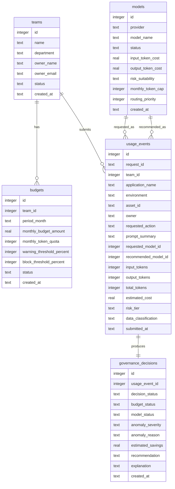

# AI-08 AI FinOps Governance Database Design

## 1 Database Design Principles

The database design for the hackathon MVP should be small, understandable, and easy for one developer to implement in one day. It must support the core AI-08 use case: AI usage tracking, token consumption, budget policies, model routing, cost optimization, anomaly detection, and chargeback reporting.

The schema should be normalized enough to avoid obvious duplication, but not so normalized that it slows down delivery. The MVP should avoid generic lookup tables, configuration sprawl, and enterprise-style data management patterns.

Design principles:

- Use SQLite for a simple local demo database.
- Keep only essential tables.
- Store teams, budgets, models, usage events, and governance decisions.
- Derive dashboard and chargeback summaries from usage events and decisions.
- Store application, environment, risk tier, and data classification directly on usage events.
- Store anomaly outcome directly on the governance decision instead of a separate alerts table.
- Use simple text enumerations instead of lookup tables.
- Use ISO-8601 text timestamps for SQLite portability.
- Use decimal-style numeric values as `REAL` for the MVP, with a future path to fixed precision in PostgreSQL or Azure SQL.
- Avoid audit, history, version, and workflow tables.
- Favor readable demo data over perfect enterprise modeling.

The goal is a clean operational schema that can power a polished dashboard, request submission flow, request history table, budget status cards, model routing result, anomaly status, and chargeback summary.

## 2 Entity Relationship Overview

### Entities

**teams**

Represents a business team consuming AI services. The team also carries lightweight department and owner information to avoid a separate departments table.

**budgets**

Represents monthly budget and quota policy for a team. This supports budget remaining, budget exceeded, quota status, warning thresholds, and chargeback context.

**models**

Represents the approved AI model catalog, including provider, cost assumptions, model status, risk suitability, and routing priority.

**usage_events**

Represents each submitted AI usage request. It captures team, app, environment, requested model, recommended model, token counts, cost estimate, risk tier, data classification, and request context.

**governance_decisions**

Represents the final AI cost and usage governance decision for each usage event. It stores decision status, budget status, model routing status, anomaly severity, recommendation, explanation, and estimated savings.

### Relationship Summary

- One team can have many budgets over different months.
- One team can have many usage events.
- One requested model can appear in many usage events.
- One recommended model can appear in many usage events.
- One usage event has one governance decision.
- Chargeback reporting is derived from teams, usage events, models, budgets, and governance decisions.
- Dashboard charts are derived from aggregated usage events and governance decisions.

### ER Diagram

## 3 Tables

Design only five essential tables:

1. teams
2. budgets
3. models
4. usage_events
5. governance_decisions

No additional tables are required for the hackathon MVP.

### teams

**Purpose**

Stores teams that consume AI services and own AI spend. Department and business owner details are stored here to keep the MVP schema small.

| Column | Data Type | Nullable | Default Value | Constraints | Description |
|---|---:|---:|---|---|---|
| id | INTEGER | No | Auto-generated | Primary key | Internal team identifier. |
| name | TEXT | No | None | Unique | Team name shown in dashboards and request forms. |
| department | TEXT | No | None | None | Business department used for grouping and chargeback. |
| owner_name | TEXT | No | None | None | Business or team owner responsible for spend. |
| owner_email | TEXT | Yes | None | None | Optional owner contact for demo reporting. |
| status | TEXT | No | active | Allowed values: active, inactive | Whether the team is available for new usage events. |
| created_at | TEXT | No | Current timestamp | ISO-8601 timestamp | Record creation timestamp. |

**Notes**

- A separate departments table is intentionally avoided.
- Department-level reporting can be produced by grouping teams by the `department` column.

### budgets

**Purpose**

Stores monthly budget and token quota policy by team. This powers budget remaining, warning thresholds, blocked requests, and chargeback summaries.

| Column | Data Type | Nullable | Default Value | Constraints | Description |
|---|---:|---:|---|---|---|
| id | INTEGER | No | Auto-generated | Primary key | Internal budget identifier. |
| team_id | INTEGER | No | None | Foreign key to teams.id | Team that owns this budget policy. |
| period_month | TEXT | No | None | Format: YYYY-MM | Budget month. Example: 2026-07. |
| monthly_budget_amount | REAL | No | 0 | Must be greater than or equal to 0 | Monthly spend budget for the team. |
| monthly_token_quota | INTEGER | No | 0 | Must be greater than or equal to 0 | Monthly token quota for the team. |
| warning_threshold_percent | INTEGER | No | 80 | Range: 1 to 100 | Percentage where budget status becomes warning. |
| block_threshold_percent | INTEGER | No | 100 | Range: 1 to 200 | Percentage where budget status becomes exceeded or blocked. |
| status | TEXT | No | active | Allowed values: active, inactive | Whether this budget policy is currently used. |
| created_at | TEXT | No | Current timestamp | ISO-8601 timestamp | Record creation timestamp. |

**Notes**

- One active budget per team per month is enough for the MVP.
- Department budgets can be represented by summing team budgets within the same department.

### models

**Purpose**

Stores approved and blocked AI models with simplified pricing assumptions. This table supports model usage, model routing, low-cost recommendations, estimated cost, and estimated savings.

| Column | Data Type | Nullable | Default Value | Constraints | Description |
|---|---:|---:|---|---|---|
| id | INTEGER | No | Auto-generated | Primary key | Internal model identifier. |
| provider | TEXT | No | None | None | Model provider, such as OpenAI, Claude, or Mock. |
| model_name | TEXT | No | None | Unique with provider | Display name for the model. |
| status | TEXT | No | approved | Allowed values: approved, restricted, blocked, inactive | Whether the model can be used or recommended. |
| input_token_cost | REAL | No | 0 | Must be greater than or equal to 0 | Cost assumption per input token for demo calculation. |
| output_token_cost | REAL | No | 0 | Must be greater than or equal to 0 | Cost assumption per output token for demo calculation. |
| risk_suitability | TEXT | No | low_medium | Allowed values: low, low_medium, all, high_only | Indicates which risk tiers this model is suitable for. |
| monthly_token_cap | INTEGER | Yes | None | Must be greater than or equal to 0 when present | Optional monthly usage cap for the model. |
| routing_priority | INTEGER | No | 100 | Lower number means preferred | Used by the Model Router Agent to prefer lower-cost approved models. |
| created_at | TEXT | No | Current timestamp | ISO-8601 timestamp | Record creation timestamp. |

**Notes**

- Pricing values are simplified for demo purposes.
- The routing priority lets the MVP recommend cheaper approved models without complex optimization logic.

### usage_events

**Purpose**

Stores each AI usage request submitted through the demo. This is the primary fact table for token tracking, spend trend charts, team spend, model usage, request history, and chargeback reporting.

| Column | Data Type | Nullable | Default Value | Constraints | Description |
|---|---:|---:|---|---|---|
| id | INTEGER | No | Auto-generated | Primary key | Internal usage event identifier. |
| request_id | TEXT | No | Generated request reference | Unique | Human-readable request identifier shown in the UI. |
| team_id | INTEGER | No | None | Foreign key to teams.id | Team that submitted or owns the request. |
| application_name | TEXT | No | None | None | Application or product generating the usage. |
| environment | TEXT | No | development | Allowed values: development, test, staging, production | Environment where usage occurred. |
| asset_id | TEXT | Yes | None | None | Asset or workload identifier from the request. |
| owner | TEXT | Yes | None | None | Request owner or application owner. |
| requested_action | TEXT | No | None | None | Business action, such as summarize, classify, generate, or analyze. |
| prompt_summary | TEXT | Yes | None | None | Short prompt summary for demo visibility. Full prompt storage is avoided. |
| requested_model_id | INTEGER | No | None | Foreign key to models.id | Model originally requested. |
| recommended_model_id | INTEGER | Yes | None | Foreign key to models.id | Model recommended by routing, when applicable. |
| input_tokens | INTEGER | No | 0 | Must be greater than or equal to 0 | Input token count. |
| output_tokens | INTEGER | No | 0 | Must be greater than or equal to 0 | Output token count. |
| total_tokens | INTEGER | No | 0 | Must be greater than or equal to 0 | Combined input and output tokens. |
| estimated_cost | REAL | No | 0 | Must be greater than or equal to 0 | Estimated request cost based on model pricing. |
| risk_tier | TEXT | No | low | Allowed values: low, medium, high | Risk level used for routing and decision logic. |
| data_classification | TEXT | No | internal | Allowed values: public, internal, confidential, restricted | Data sensitivity signal used for model routing and approval decisions. |
| submitted_at | TEXT | No | Current timestamp | ISO-8601 timestamp | Request submission timestamp. |

**Notes**

- `usage_events` intentionally stores `application_name` as text to avoid an applications table.
- `environment`, `risk_tier`, and `data_classification` are simple text enums, not lookup tables.
- Chargeback summaries are generated by grouping this table by team, department, model, application, and date.

### governance_decisions

**Purpose**

Stores the final governance outcome for each usage event. This table supports the request result panel, request history, decision breakdown chart, active alerts section, AI recommendation panel, and anomaly status.

| Column | Data Type | Nullable | Default Value | Constraints | Description |
|---|---:|---:|---|---|---|
| id | INTEGER | No | Auto-generated | Primary key | Internal decision identifier. |
| usage_event_id | INTEGER | No | None | Foreign key to usage_events.id, unique | Usage event evaluated by the decision engine. |
| decision_status | TEXT | No | None | Allowed values: allow, warn, block, require_approval | Final decision shown in badges and result panels. |
| budget_status | TEXT | No | within_budget | Allowed values: within_budget, near_limit, exceeded, no_budget | Budget result from the Budget Policy Agent. |
| model_status | TEXT | No | approved | Allowed values: approved, rerouted, restricted, blocked | Model routing or model policy result. |
| anomaly_severity | TEXT | No | none | Allowed values: none, low, medium, high | Cost or usage anomaly severity. |
| anomaly_reason | TEXT | Yes | None | None | Short explanation of spike or unusual usage when present. |
| estimated_savings | REAL | No | 0 | Must be greater than or equal to 0 | Estimated savings from model routing. |
| recommendation | TEXT | Yes | None | None | Short AI FinOps recommendation shown in the UI. |
| explanation | TEXT | No | None | None | Plain-language explanation of the final decision. |
| created_at | TEXT | No | Current timestamp | ISO-8601 timestamp | Decision creation timestamp. |

**Notes**

- Anomaly details are stored here instead of creating a separate anomaly table.
- Decision explanation is stored as text for a simple and compelling demo result panel.

## 4 Relationships

### One-to-Many

- One team has many budgets.
- One team has many usage events.
- One requested model has many usage events.
- One recommended model can appear in many usage events.

### One-to-One

- One usage event has one governance decision.

### Many-to-One

- Many budgets belong to one team.
- Many usage events belong to one team.
- Many usage events reference one requested model.
- Many usage events may reference one recommended model.
- Many governance decisions are indirectly associated with teams and models through usage events.

### Foreign Keys

Recommended foreign keys:

- `budgets.team_id` references `teams.id`.
- `usage_events.team_id` references `teams.id`.
- `usage_events.requested_model_id` references `models.id`.
- `usage_events.recommended_model_id` references `models.id`.
- `governance_decisions.usage_event_id` references `usage_events.id`.

### Cascade Rules

Recommended cascade behavior:

- Do not physically delete teams that have usage events. Set `teams.status` to `inactive`.
- Do not physically delete models that have usage events. Set `models.status` to `inactive`.
- If a usage event is deleted during demo cleanup, delete its governance decision with it.
- If a budget is deleted, keep usage events unchanged because spend history is tied to actual requests, not the budget row.
- For the hackathon MVP, prefer soft deactivation for teams and models, and simple cleanup only for demo reset data.

## 5 Enumerations

Use text enum values. Avoid generic lookup tables for the MVP.

### Decision Status

- `allow`: Request can proceed.
- `warn`: Request can proceed with cost or policy warning.
- `block`: Request should not proceed.
- `require_approval`: Request requires approval before proceeding.

### Risk Tier

- `low`: Low-risk request suitable for low-cost model routing.
- `medium`: Standard request where routing may be allowed.
- `high`: Higher-risk request that may require stronger model selection or approval.

### Environment

- `development`: Development or experimentation.
- `test`: Test validation environment.
- `staging`: Pre-production environment.
- `production`: Production workload.

### Budget Status

- `within_budget`: Spend and quota are healthy.
- `near_limit`: Spend or quota is near the warning threshold.
- `exceeded`: Spend or quota has crossed the blocking threshold.
- `no_budget`: No active budget exists for the team and period.

### Model Status

- `approved`: Requested model is approved and allowed.
- `rerouted`: A cheaper approved model is recommended.
- `restricted`: Requested model has constraints or should be avoided for this request.
- `blocked`: Requested model is not allowed.

### Model Catalog Status

- `approved`: Model can be selected and recommended.
- `restricted`: Model can be used only under stricter conditions.
- `blocked`: Model should not be used.
- `inactive`: Model remains in historical records but is not available for new requests.

### Anomaly Severity

- `none`: No anomaly detected.
- `low`: Mild abnormal usage.
- `medium`: Notable token or cost spike.
- `high`: Significant spike or suspicious usage pattern.

### Team Status

- `active`: Team can submit usage events.
- `inactive`: Team is hidden from new request forms but retained for historical summaries.

### Budget Policy Status

- `active`: Budget policy is used for decisioning.
- `inactive`: Budget policy is not used for new decisions.

### Data Classification

- `public`: Public or non-sensitive content.
- `internal`: Internal business content.
- `confidential`: Sensitive business content.
- `restricted`: Highly sensitive content.

## 6 Sample Data

The sample data should make the five-minute demo feel realistic and immediately understandable.

### Teams

Recommended teams:

- Customer Analytics, department: Sales Operations, owner: Priya Menon.
- Support Automation, department: Customer Experience, owner: David Chen.
- Engineering Productivity, department: Technology, owner: Aisha Khan.
- Finance Insights, department: Finance, owner: Marcus Lee.

These teams create natural variation in spend, models, apps, and budget pressure.

### Budgets

Recommended budget examples:

- Customer Analytics has a healthy monthly budget and moderate token quota.
- Support Automation is near its monthly budget threshold.
- Engineering Productivity has high token usage but still has budget remaining.
- Finance Insights has a small budget and can trigger a budget exceeded demo.

Use one budget row per team for the current month.

### Models

Recommended model catalog:

- Premium reasoning model: approved or restricted, higher token cost, suitable for high-risk tasks.
- Standard balanced model: approved, medium token cost, suitable for most tasks.
- Low-cost fast model: approved, low token cost, preferred for low-risk summarization and classification.
- Blocked experimental model: blocked, used to demonstrate model policy rejection if needed.

The model names can be provider-neutral or mapped to OpenAI, Claude, or mocked models depending on implementation choice.

### Usage Events

Recommended demo usage events:

- Normal Request: Customer Analytics summarizes sales notes using an approved standard model.
- Model Routing: Support Automation requests a premium model for low-risk FAQ summarization and receives a lower-cost recommendation.
- Budget Exceeded: Finance Insights submits a request after crossing the monthly budget threshold.
- Cost Spike: Engineering Productivity submits unusually high token usage compared with baseline.
- Require Approval: A production request with high risk tier and confidential or restricted data classification.

Include enough historical events to make charts look populated:

- 7 to 14 days of spend trend records.
- 15 to 30 recent usage events.
- A mix of allow, warn, block, and require approval decisions.
- A few records with estimated savings from model routing.
- A few records with medium or high anomaly severity.

### Governance Decisions

Recommended decision examples:

- Allow: "Request is within budget and uses an approved model."
- Warn: "Team is near monthly budget; low-cost routing is recommended."
- Block: "Team has exceeded the monthly budget threshold."
- Require Approval: "Request has high cost impact and elevated risk signals."

Decision explanations should be short and readable because they appear directly in the UI.

## 7 Index Strategy

Use only essential indexes. The data volume is small for the hackathon, and over-indexing would add unnecessary implementation work.

Recommended indexes:

- Unique index on `teams.name`.
- Index on `teams.department` for department-level dashboard grouping.
- Unique index on `budgets.team_id` plus `budgets.period_month` for one budget per team per month.
- Unique index on `models.provider` plus `models.model_name`.
- Index on `models.status` for approved model lookups.
- Unique index on `usage_events.request_id`.
- Index on `usage_events.team_id` for team spend and chargeback.
- Index on `usage_events.submitted_at` for dashboard date range filtering.
- Index on `usage_events.requested_model_id` for model usage charts.
- Unique index on `governance_decisions.usage_event_id`.
- Index on `governance_decisions.decision_status` for request history filters.
- Index on `governance_decisions.anomaly_severity` for active alert sections.

Avoid indexes on every text enum. Add more only if a real query becomes slow.

## 8 Future Expansion

SQLite is sufficient for the one-day MVP, but the schema can move to PostgreSQL or Azure SQL later with limited conceptual change.

### PostgreSQL or Azure SQL Migration Path

- Replace SQLite `INTEGER` primary keys with identity columns or generated primary keys.
- Replace `REAL` money fields with fixed precision decimal types.
- Replace text enums with database enum types or constrained reference tables if governance rules become more complex.
- Replace ISO-8601 text timestamps with native timestamp types.
- Add stronger uniqueness and validation constraints.
- Add separate departments, applications, anomaly alerts, and chargeback report tables when the product needs deeper enterprise reporting.
- Add row-level security or tenant identifiers for multi-tenant deployments.
- Add materialized summaries or reporting views if dashboard queries grow large.
- Move demo seed data into a controlled migration or fixture process.

The logical model remains stable: teams own usage, budgets define limits, models define cost and routing options, usage events capture consumption, and decisions capture governance outcomes.

## 9 Hackathon Simplifications

The following simplifications are intentional:

- Five tables only.
- No separate departments table.
- No separate applications table.
- No separate environments table.
- No generic lookup tables.
- No separate anomaly alerts table.
- No separate chargeback reports table.
- No workflow table for approvals.
- No user or role tables.
- No audit, history, or version tables.
- No multi-tenant schema.
- No advanced financial period modeling.
- No live cloud cost ingestion tables.
- No raw prompt storage table.
- No model pricing history table.

Dashboard metrics are generated through simple aggregation. Chargeback reporting is derived from teams and usage events. Active alerts are derived from governance decisions with anomaly severity. This keeps the database small while fully supporting the polished AI-08 demo.
